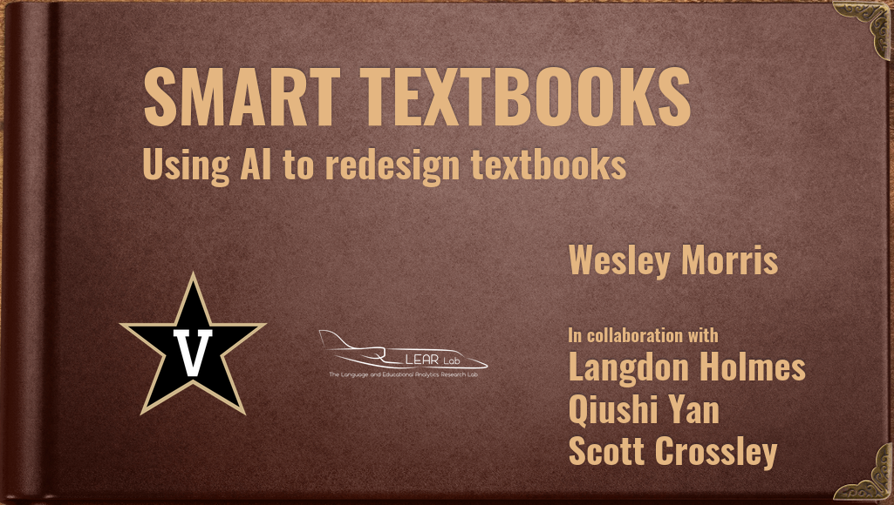
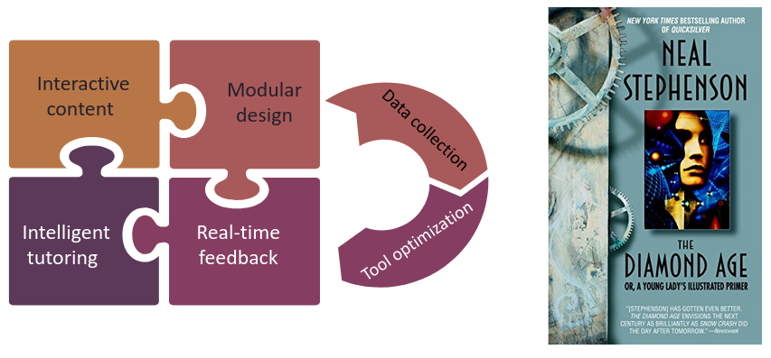
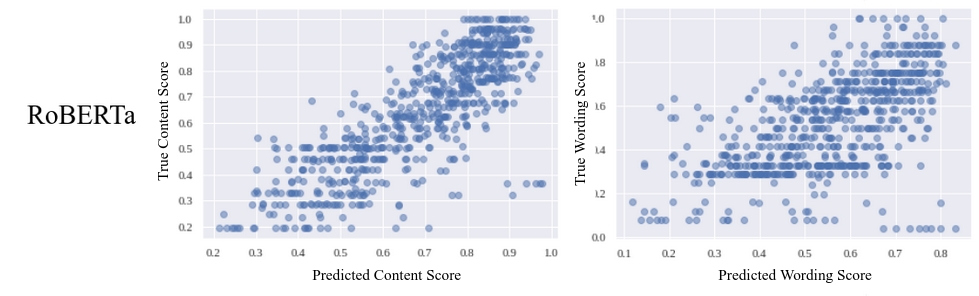
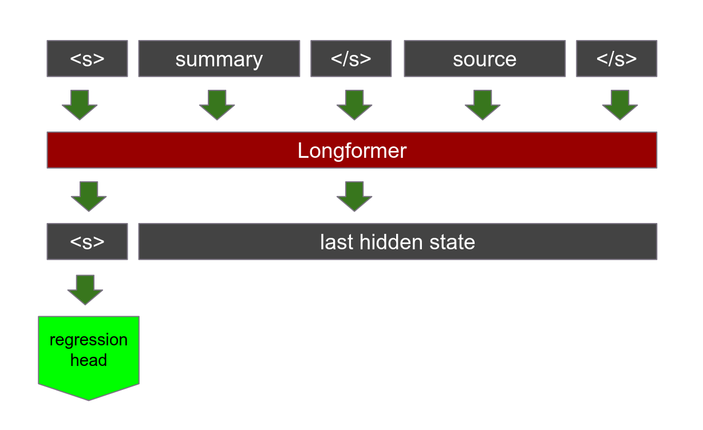
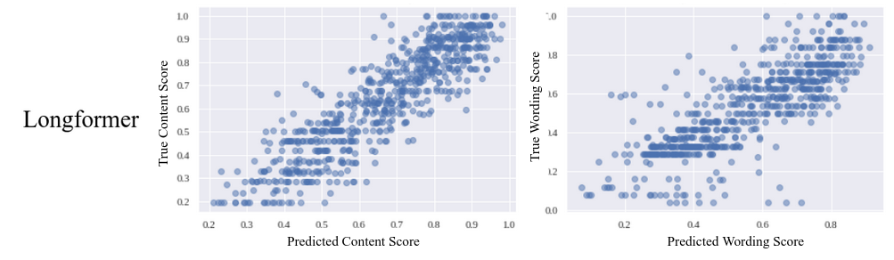

# Intelligent Textbook
This is a repository of code for automatic summary evaluation. Specifically, it contains the source code used to develop transormer models that can predict human scores of summaries. This was developed as part of a larger project to develop an intelligent textbook, one which is responsive to the needs of the user and provides adaptive feedback and tutoring.

## Prototype
To create our first prototype, we are using the OpenStax textbook on Macroeconomics. We chose OpenStacks because it is a free and open source repository of electronic textbooks. Additionally, all of the OpenStax textbooks are formatted in a broadly similar way. Thus, the intelligent element of the textbook should be modular and able to apply to any of the OpenStax library. The original textbook on Macroeconomics can be found [here](https://openstax.org/books/principles-macroeconomics-ap-courses-2e/pages/1-introduction). Our prototype based off of this textbook can be found [here](https://textbook-demo.web.app/module-1/chapter-1/section-1/). Please be aware that we are still in the very early stages.

## Summary Grading
As a first step toward our intelligent textbook, we created a feature where the student writes a short summary at the end of each chapter. These summaries, between 50 and 200 words, will be graded automatically by two pretrained transformer models. These models were finetuned using 4,690 summaries collated by Botarleanu et. al. (2022). These summaries were graded by expert human raters on six criteria. The dimensionality was reduced to two using a principle component analysis:
* Details, main point, and cohesion were combined into a weighted score called **Content**.
* Paraphrasing, objective language use, and language beyond the source were combined into a weighted score designated as **Wording**.

### Grading Summaries using RoBERTa
We attempted two strategies, the first using a RoBERTa pretrained model where only the summaries were used to predict the score. This technique was surprisingly effective, especially in Content where it achieved an R2 of 0.67 when predicting scores against the test group. However, in wording the model only achieved an R2 of 0.36. This may have been largely because some summaries that appeared high-quality were actually plagiarized and had a low score from the human raters. Because this model was naive to the source, it was not able to catch plagiarism when it arose.

### Grading Summaries using Longformer
The second strategy used a Longformer pretrained model. Longformer uses sparse attention, a moving attention window, to process much larger contexts while remaining computationally efficient. Longformer model is able to process sequences of up to 4,096 tokens. When providing input to finetune the Longformer model, the summary came first, followed by the source, seperated by a seperator token. 

This method allowed the model to have access to both the summary and the source, which made it much more accurate when it was predicting scores. When predicting scores against the test group, the Content model reported an R2 of 0.79 and the Wording model reported an R2 of 0.66. This is much higher than the RoBERTa model and good enough to put into production.

## Production
Both the [content](https://huggingface.co/tiedaar/summary-longformer-content) and the [wording](https://huggingface.co/tiedaar/summary-longformer-wording) Longformer models can be found at the HuggingFace hub. In addition, I created a [Huggingface space](https://huggingface.co/spaces/tiedaar/economics_summary_grader) using Gradio where people can try out the model for themselves. Finally, the prototype textbook itself can be found [here](https://textbook-demo.web.app/module-1/chapter-1/section-1/), although it is still very much a work in progress.

## Critical Analysis
### It's too slow
* Inference can take more than a minute on the Huggingface Spaces
* We may speed it up by using a multi-task model which uses the same classification token to predict both scores.
* We may follow Fernandez et. al. (2022) who use two BERT models. The first generates a classification token from the source, then that token is fed in to the input for the summary.
### Improving the accuracy
* Domain adaptation might help
* We can use an unlabeled corpus of around 90,000 summaries from CommonLit.

## Resources
* [Huggingface model doc for Longformer](https://huggingface.co/docs/transformers/model_doc/longformer)
* Beltagy, I., Peters, M. E., & Cohan, A. (2020). Longformer: The Long-Document Transformer (arXiv:2004.05150). arXiv. https://doi.org/10.48550/arXiv.2004.05150
* Botarleanu, R.-M., Dascalu, M., Allen, L. K., Crossley, S. A., & McNamara, D. S. (2022). Multitask Summary Scoring with Longformers. In M. M. Rodrigo, N. Matsuda, A. I. Cristea, & V. Dimitrova (Eds.), Artificial Intelligence in Education (Vol. 13355, pp. 756–761). Springer International Publishing. https://doi.org/10.1007/978-3-031-11644-5_79
* Crossley, S. A., Kim, M., Allen, L., & McNamara, D. (2019). Automated Summarization Evaluation (ASE) Using Natural Language Processing Tools. In S. Isotani, E. Millán, A. Ogan, P. Hastings, B. McLaren, & R. Luckin (Eds.), Artificial Intelligence in Education (Vol. 11625, pp. 84–95). Springer International Publishing. https://doi.org/10.1007/978-3-030-23204-7_8
* Liu, Y., Ott, M., Goyal, N., Du, J., Joshi, M., Chen, D., & Stoyanov, V. (2019). Roberta: A robustly optimized bert pretraining approach. arXiv preprint arXiv:1907.11692.

## Video
[Video Link Here](https://www.youtube.com/watch?v=WZxqA_x39I4)
